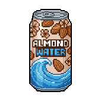
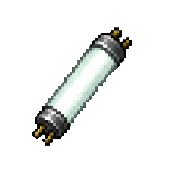
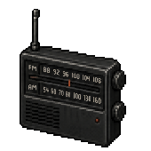
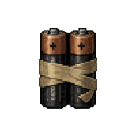

<div align="center">

# 🟨 Backrooms Escape — Idle








**You've no-clipped out of reality. Descend the endless backrooms, scavenge what you can, and keep going — forever.**


</div>

---

## 📖 About

**Backrooms Escape** is a portrait, tap-and-idle game built in **Phaser 3** for the **[RUN.game](https://run.game)** platform. You are trapped in the *Backrooms* — an infinite labyrinth of liminal, wrong spaces behind reality. There's no winning, only **going deeper**: each floor is a new dread-soaked location, each resource a thing you pry out of the dark, each descent a step further from the way out.

The hook is the classic idle-clicker dopamine loop — **tap to search, watch the numbers climb, spend them to climb faster, descend, repeat** — wrapped in survival-horror atmosphere instead of mining.

> ### What are the Backrooms?
> A creepypasta / liminal-space mythos: if you "no-clip" out of reality in the wrong spot, you fall into the Backrooms — endless mono-yellow rooms, buzzing fluorescent lights, damp carpet, and the ever-present hum. Deeper "Levels" get stranger and more hostile (Poolrooms, the Red Halls, abandoned offices, reactors…), and they're stalked by **entities** (Smilers, Hounds, Skin-Stealers, Partygoers, The Wretched…). This game leans on that canon for its floors, resources, and — soon — its monsters.

---

## 🎮 The Core Loop

You're not mining — you're **searching**. Every floor has one resource hidden in it, behind a pool of **Integrity** (think node HP).


1. **Tap or hold** the central icon to *search*. Each tap deals **Search Power** to the node's Integrity and pops a floating damage number. (Every distinct tap counts — no cooldown; holding auto-repeats.)
2. **Lucky Finds (crits)** multiply a hit **×3** — a big gold number. Crit chance starts at **0%** and is raised by upgrades; crits fire on **both taps and the auto-drone**.
3. When Integrity hits zero, the node **breaks** → you collect the resource, then it **respawns after a short delay** before the next appears (so you actually see it drop to zero).
4. Spend resources on **upgrades** (see below). Most are **hidden as `??????` until you descend deep enough to reveal them** — a gentle drip of new toys.
5. Watch for the occasional **moth** that flutters across the screen — click it (or auto-catch it with *Trapper*) for a rare **Moth**. It's the one resource not tied to a floor.
6. Every couple minutes your **Explorer** offers **HYPE!** — tap him to trigger a timed **×3 auto-search** burst (he literally sprints faster).
7. Descend via the **▶** arrow once you've explored enough; hit a wall? **Rewind** (prestige) for permanent **Void** bonuses and climb again, stronger.

### How node HP scales

Node HP is **hand-tuned for the first few floors** (to keep an early difficulty spike), then grows by a gentle **×1.5 per floor** for the infinite tail:

| Floor | 0 | 1 | 2 | 3 | 4 | 5 | 10 | 20 | 30 |
|---|---|---|---|---|---|---|---|---|---|
| **HP** | 10 | 30 | 60 | 120 | 250 | 375 | ~2.8K | ~164K | ~9.5M |

HP is the **displayed value directly** (no hidden magnitude multiplier), and one search removes your **Search Power** in the same units — so `taps-to-break = HP ÷ power`.

> **Balance principle:** a pure ×2 ("doubling") curve outruns additive power and walls into boredom fast. **×1.5** keeps the numbers climbing into the millions/billions for the big-number payoff while staying reachable — *provided power upgrades scale multiplicatively* to keep pace (the planned "other half" of balance). The curve is one knob: `NODE_HP` (the tuned intro) + `HP_GROWTH` in [`src/data/GameData.ts`](src/data/GameData.ts).

### Upgrades

Each upgrade is a small data entry in `UPGRADES` (`src/data/GameData.ts`); costs follow `round(base × mult^level)`, and an upgrade can declare extras like `unlockFloor` (progressive `??????` reveal) or `costResourceCycle` (a different resource each level).

**The per-floor ladder.** Beyond the three starter upgrades, the roster follows a deliberate shape: **one upgrade unlocks per floor, priced in that floor's resource**, and both the **base cost** and the **growth multiplier climb with depth** — deeper upgrades cost more up front *and* scale steeper. New floors also **rotate the lever** (tap/auto/Explorer power, crit %, crit damage, quality, easy-access) instead of repeating one.

| Floor | Upgrade | Effect | Resource | Base | Growth | Max |
|---|---|---|---|---|---|---|
| — | **Auto Explore** | +1 auto-search/sec (the drone) | Almond Water | 5 | 1.2× | 15 |
| — | **Moth Powers** | +2 tap **&** auto power | Moths | 5 | 1.4× | 15 |
| — | **Master Scav** | +5 tap **&** auto power | *cycles all floor resources* | 100 | 1.3× | 31 |
| 1 | **Sharp Eye** | +1 tap power | Wallpaper Strip | 5 | 1.2× | 15 |
| 1 | **Trapper** | +1% moth auto-capture | Wallpaper Strip | 30 | 1.2× | 50 |
| 2 | **Rally Cry** | +0.5s hype duration | Carpet Swatch | 50 | 1.3× | 30 |
| 3 | **Lucky Find** | +1% crit chance (×3 dmg) | Ceiling Tile | 5 | 1.2× | 15 |
| 4 | **Heavy Sweep** | +2 auto/sec per Explorer | Fluorescent Tube | 5 | 1.2× | 15 |
| 4 | **Quality Find** | +1 yield on a quality find | Fluorescent Tube | 1000 | 1.5× | 2 |
| 5 | **Quality Sense** | +0.25% quality chance | Cloth Scraps | 5 | 1.2× | 20 |
| 6 | **Splinters** | +3 tap **&** Explorer power | Scrap Wood | 8 | 1.3× | 15 |
| 7 | **Metal Head** | +0.2× crit damage | Scrap Metal | 12 | 1.35× | 15 |
| 8 | **Stocked Shelves** | +0.5% Easy Access (½-HP nodes) | Copper Wire | 15 | 1.4× | 15 |

> **The scaling rule** (floors 5→8): growth multiplier `1.2 → 1.3 → 1.35 → 1.4` (deltas taper: +0.10, +0.05, +0.05) and base cost `5 → 8 → 12 → 15` (~+3–4/floor). `maxLevel: 15` is the default. So floor 9 (Duct Tape) would land near **base ~18–20, growth ~1.45×** — new tiers can be *derived* from this curve rather than hand-tuned.

Power comes in channels that stack and are summed generically (so a new upgrade just declares its `effect`): **tap-only** (`power`), **tap + auto** (`flatPower`), **tap + per-Explorer** (`tapExplorer`), **per-Explorer auto** (`explorerAuto`), plus standalone systems — **crit** (`critChance` + `critDamage` ×mult), **quality** (`quality` chance / `qualityYield`), **Easy Access** (`easyAccess`, ½-HP brittle nodes), **auto-capture**, and **hype** (duration). All damage resolves to **whole integers**. The **Stats** menu (top-left) surfaces the live totals.

**Two meta-currency menus** sit alongside the resource upgrades, both spending/earning **Void Shards** (earned by maxing an upgrade or reaching a new floor):
- **Shop** — permanent Void-Shard upgrades (flat `base + step×level` cost): *Search Upgrade*, *Hype Train*.
- **Achievements** — tiered goals that pay scaling Void Shards on claim (e.g. *Pack Rat*: total resources), and grant a global **+0.5% auto-search per claimed tier** across all achievements.

There are **31 hand-authored floors** that cycle forever — every full lap bumps the *tier* (a new color-grade + tougher danger), so the world re-skins itself endlessly with the same beloved locations.

---

## 🧠 Big Numbers — read this before you touch the economy

> **This is the single most important architectural detail in the project.**

Idle economies grow **exponentially**. A normal JavaScript `number` is a 64-bit float with two hard ceilings:
- Integer precision dies at **2⁵³ ≈ 9×10¹⁵** (`Number.MAX_SAFE_INTEGER`) — past it, integers silently round.
- The value itself dies at **~1.8×10³⁰⁸** (`Number.MAX_VALUE`) — past it you get `Infinity`.

Upgrade costs (`baseCost × mult^level`), Search Power, and node Integrity blow through both in normal play. So **every unbounded value is a big number**, not a `number`.

### How it's wired

The RUN.game SDK bundles **[break_eternity.js](https://github.com/Patashu/break_eternity.js)** — a `Decimal` type stored as `sign / mantissa / layer` (tetration-based). It has **no practical ceiling** (it can represent `10↑↑(huge)`), so the game can genuinely run forever.

Everything routes through **[`src/num.ts`](src/num.ts)**, a thin typed wrapper:

```ts
import { D, fmt, type Big } from './num';

const cost = D(4).mul(D(1.8).pow(level)).floor();   // never overflows
label.setText(`Cost: ${fmt(cost)}`);                 // "377.21Sx", then "1.23e+45"
if (resources[id].gte(cost)) { /* afford */ }
```

- `D(x)` — make a `Big` from a number, decimal string, or another `Big`
- `fmt(x)` — short display: `30` → `1.23K` → `9.99Dc` → scientific `1.23e+45`
- `Big` — a **typed** interface over the SDK's `any`-typed Decimal, so a typo like `.plus` (vs `.add`) fails at *compile* time

### ⚠️ Two gotchas that will bite you (they bit us)

1. **`RundotGameAPI.numbers` is populated by an _async_ init.** It does **not** exist at module-load time. `num.ts` resolves it **lazily, per call** — never capture it at the top of a module, and never build a `Big` constant at import time, or the game crashes on boot.
2. **`numbers` is a _proxied_ object**, so `new RundotGameAPI.numbers.Decimal(x)` throws `Cannot call a class as a function` (the proxy hands back a *method*, not the raw class). Construct via **`RundotGameAPI.numbers.normalize(x)`** instead — that's what `D()` does.

### What's `Big` vs what stays `number`

| Big (unbounded, compounds) | Plain `number` (bounded, counts discrete things) |
|---|---|
| resource counts | floor index, upgrade levels |
| upgrade costs | exploration progress (capped per floor) |
| Search Power / Auto-search | HP, Sanity, percentages |
| node Integrity & damage | crit chance/mult, cooldown ms |
| | Void fragments / shards, run stats |

> Bounded counters stay `number` on purpose — they tick by discrete events and can't realistically overflow, so making them `Big` would only add overhead.

**Saves:** resource `Big` values serialize as **decimal strings**; `D()` accepts both strings and legacy numeric saves, so old saves load cleanly.

---

## 🗂️ Project Structure

```
src/
  main.ts            # Phaser bootstrap (game config, scene registration)
  config.ts          # LAYOUT constants (720×1560 portrait) + tick/save intervals
  num.ts             # ⭐ big-number wrapper (D / fmt / Big) — see above
  GameState.ts       # ALL game logic: economy, upgrades, prestige, save/load, tick
  data/
    GameData.ts      # static data: 31 floors, resources, upgrades, gear, recipes, shop, abilities
  scenes/
    GameScene.ts     # the Phaser scene: update loop, input → state, analytics, persistence
  ui/
    UIManager.ts     # every on-screen element (drawn as Phaser GameObjects — no DOM/HTML UI)
public/
  icons/             # PNG art: resources, upgrades, abilities, entities, equipment, prestige
  wallpaper.png      # backdrop
```

**Architecture in one line:** `GameScene` owns the loop and forwards input to `GameState` (pure logic), which returns events that `UIManager` renders. `GameData` is static; `num.ts` is the math substrate. **The entire UI is drawn in Phaser** (rectangles/text/images/containers) — there is no React/HTML layer.

> 🔧 **Heads-up:** `package.json` `name` is still the template default (`run-template-2d-phaser-suika`) and `devDependencies` carry some unused template leftovers (`firebase`, `@babel/parser`, `magic-string`). Cleaning these is a safe future chore.

---

## 🚀 Getting Started

```bash
npm install        # install deps (Phaser + RUN.game SDK)
npm run dev        # Vite dev server → http://localhost:5173
npm run build      # type-check (tsc) + production build to dist/
npm run preview    # serve the production build locally
```

- **Type-check only:** `npx tsc --noEmit`
- **Deploy** (RUN.game): `npm run deploy` *(build + `rundot deploy` — publishes to the platform, so it's a deliberate, separate step)*

Saves live in the SDK's `appStorage` under the key **`backrooms_save`** (offline progress is granted on load based on elapsed time).

---

## 🗺️ Roadmap & Ideas

**Done so far** (the active redesign)
- ✅ Search/Integrity core loop with a **node respawn** lifecycle and clean hand-tuned HP + ×1.5 tail.
- ✅ Rebuilt **upgrade system** (data-driven, progressive `unlockFloor` reveal, cycling cost resources, hide-maxed toggle).
- ✅ **Crit** system (tap + auto, upgrade-gated, with upgradable crit *damage*), **Hype** burst, the **moth** collectible + auto-capture, **Stats** menu, per-tab alert dots, the running **Explorer** sprite.
- ✅ **Quality / Mint / Easy-Access** node grades (yield + brittle-HP rolls), all-integer damage rounding.
- ✅ **Void Shard** economy: a **Shop** of permanent upgrades and an **Achievements** menu (tiered, scaling rewards + a global auto-search bonus), earned by maxing upgrades / reaching new floors.

**Near-term**
- [ ] **The "other half" of balance** — *multiplicative* power upgrades (e.g. +%/level or ×per-tier) and/or prestige multipliers so power keeps pace with the ×1.5 HP curve (constant time-per-floor = no wall). The flat `+N` upgrades are early boosters only.
- [ ] **Scaling resource yield** — make a node break grant *more than +1* via upgrades, so inventories climb into big-number territory (`gain` in `resolveNode()`).
- [ ] **Monsters / danger layer** — a *noise* meter that fills as you search loudly; max it and an **entity** interrupts you. Threat art is staged (`clump`, `doll_face`, `moth`, `scrambles`, `corpus_vitis`, `lucky_crane`, `elevator`).
- [ ] **Node modifiers** — *Buried* / *Shrouded* armor on deeper floors, giving upgrades a counter-target.
- [ ] **Boss monsters** guarding milestone floors — a gate you must out-power.

**Later**
- [ ] Weapon-tier visuals for the Explorer (pistol → gun → shotgun → AR run cycles tied to tap-damage) and hired companions; new equipment (`combat_knife`, `crowbar`, `vhs_camera`, `watch` art staged).
- [ ] Deeper prestige / void tree tuned around big-number pacing.
- [ ] Settings polish, achievements, leaderboard (RUN.game SDK), monetization pass.
- [ ] UI/button cleanup; repo hygiene (rename package, drop unused template deps).

> **Design principles:** focused, shippable slices over big rewrites. Keep `taps-to-break` balanced when scaling magnitudes. Theme is **searching / scavenging / sneaking**, *not* attacking — combat arrives with the monster layer.

---

## 🛠️ Tech Stack

- **[Phaser 3.90](https://phaser.io)** — game engine (WebGL/Canvas), all UI drawn as GameObjects
- **[Vite 6](https://vitejs.dev)** + **TypeScript** (`strict`, `noUnusedLocals`, `noUnusedParameters`)
- **[RUN.game SDK 5.17](https://run.game)** — platform: `appStorage`, analytics, haptics, IAP, lifecycles, **`numbers` (break_eternity)**
- Portrait canvas **720 × 1560**, `Phaser.Scale.FIT` + center

---

<div align="center">
<sub>Built with Phaser on the RUN.game platform · the hum never stops 🟨</sub>
</div>
