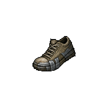
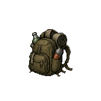
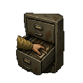
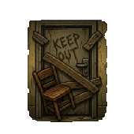
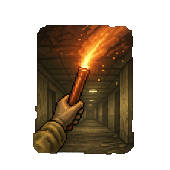
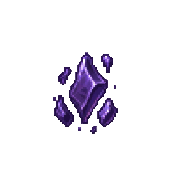
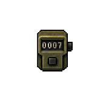

<div align="center">

# 🟨 Backrooms Escape — Idle


**You've no-clipped out of reality. Descend the endless backrooms, scavenge what you can, and keep going — forever.**


</div>

---

## 📖 About

**Backrooms Escape** is a portrait, tap-and-idle game built in **Phaser 3** for the **[RUN.game](https://run.game)** platform. You are trapped in the *Backrooms* — an infinite labyrinth of liminal, wrong spaces behind reality. There's no winning, only **going deeper**: each floor is a new dread-soaked location, each resource a thing you pry out of the dark, each descent a step further from the way out.

The hook is the classic idle-clicker dopamine loop — **tap to search, watch the numbers climb, spend them to climb faster, descend, repeat** — wrapped in survival-horror atmosphere instead of mining.

> ### What are the Backrooms?
> A creepypasta / liminal-space mythos: if you "no-clip" out of reality in the wrong spot, you fall into the Backrooms — endless mono-yellow rooms, buzzing fluorescent lights, damp carpet, and the ever-present hum. Deeper "Levels" get stranger and more hostile (Poolrooms, the Red Halls, abandoned offices, reactors…), and they're stalked by **entities** (Smilers, Hounds, Skin-Stealers, Partygoers, The Wretched…). This game leans on that canon for its floors, resources, and — soon — its monsters.

---

## 🎮 The Core Loop

You're not mining — you're **searching**. Every floor has one resource hidden in it, behind a pool of **Integrity** (think node HP).


1. **Tap or hold** the central icon to *search*. Each tap deals **Search Power** to the node's Integrity and pops a floating damage number.
2. **Lucky Finds (crits)** occasionally land for ×5 — a big gold number.
3. When Integrity hits zero, the node **breaks** → you collect the resource (+1, sometimes +2) and it refills.
4. Spend resources on **upgrades** (faster taps, more power, auto-search, better luck), descend via the **▶** arrow once you've explored enough, and do it all again — deeper, with bigger numbers.
5. Hit a wall? **Rewind** (prestige) for permanent **Void** bonuses and start the climb over, stronger.

### Why the numbers feel good

The node's Integrity *and* your Search Power are multiplied by the **same per-floor magnitude scale**. That means **taps-to-break stays balanced** at every depth, but the on-screen numbers grow into the thousands → millions → billions → and far beyond. The drama is real growth, not busywork.

| Layer | Icons |
|---|---|
| **Search upgrades** |     |
| **Abilities** |    |
| **Prestige / Void** |     |
| **Threats** *(returning soon)* |      |

There are **31 hand-authored floors** that cycle forever — every full lap bumps the *tier* (a new color-grade + tougher danger), so the world re-skins itself endlessly with the same beloved locations.

---

## 🧠 Big Numbers — read this before you touch the economy

> **This is the single most important architectural detail in the project.**

Idle economies grow **exponentially**. A normal JavaScript `number` is a 64-bit float with two hard ceilings:
- Integer precision dies at **2⁵³ ≈ 9×10¹⁵** (`Number.MAX_SAFE_INTEGER`) — past it, integers silently round.
- The value itself dies at **~1.8×10³⁰⁸** (`Number.MAX_VALUE`) — past it you get `Infinity`.

Upgrade costs (`baseCost × mult^level`), Search Power, and node Integrity blow through both in normal play. So **every unbounded value is a big number**, not a `number`.

### How it's wired

The RUN.game SDK bundles **[break_eternity.js](https://github.com/Patashu/break_eternity.js)** — a `Decimal` type stored as `sign / mantissa / layer` (tetration-based). It has **no practical ceiling** (it can represent `10↑↑(huge)`), so the game can genuinely run forever.

Everything routes through **[`src/num.ts`](src/num.ts)**, a thin typed wrapper:

```ts
import { D, fmt, type Big } from './num';

const cost = D(4).mul(D(1.8).pow(level)).floor();   // never overflows
label.setText(`Cost: ${fmt(cost)}`);                 // "377.21Sx", then "1.23e+45"
if (resources[id].gte(cost)) { /* afford */ }
```

- `D(x)` — make a `Big` from a number, decimal string, or another `Big`
- `fmt(x)` — short display: `30` → `1.23K` → `9.99Dc` → scientific `1.23e+45`
- `Big` — a **typed** interface over the SDK's `any`-typed Decimal, so a typo like `.plus` (vs `.add`) fails at *compile* time

### ⚠️ Two gotchas that will bite you (they bit us)

1. **`RundotGameAPI.numbers` is populated by an _async_ init.** It does **not** exist at module-load time. `num.ts` resolves it **lazily, per call** — never capture it at the top of a module, and never build a `Big` constant at import time, or the game crashes on boot.
2. **`numbers` is a _proxied_ object**, so `new RundotGameAPI.numbers.Decimal(x)` throws `Cannot call a class as a function` (the proxy hands back a *method*, not the raw class). Construct via **`RundotGameAPI.numbers.normalize(x)`** instead — that's what `D()` does.

### What's `Big` vs what stays `number`

| Big (unbounded, compounds) | Plain `number` (bounded, counts discrete things) |
|---|---|
| resource counts | floor index, upgrade levels |
| upgrade costs | exploration progress (capped per floor) |
| Search Power / Auto-search | HP, Sanity, percentages |
| node Integrity & damage | crit chance/mult, cooldown ms |
| | Void fragments / shards, run stats |

> Bounded counters stay `number` on purpose — they tick by discrete events and can't realistically overflow, so making them `Big` would only add overhead.

**Saves:** resource `Big` values serialize as **decimal strings**; `D()` accepts both strings and legacy numeric saves, so old saves load cleanly.

---

## 🗂️ Project Structure

```
src/
  main.ts            # Phaser bootstrap (game config, scene registration)
  config.ts          # LAYOUT constants (720×1560 portrait) + tick/save intervals
  num.ts             # ⭐ big-number wrapper (D / fmt / Big) — see above
  GameState.ts       # ALL game logic: economy, upgrades, prestige, save/load, tick
  data/
    GameData.ts      # static data: 31 floors, resources, upgrades, gear, recipes, shop, abilities
  scenes/
    GameScene.ts     # the Phaser scene: update loop, input → state, analytics, persistence
  ui/
    UIManager.ts     # every on-screen element (drawn as Phaser GameObjects — no DOM/HTML UI)
public/
  icons/             # PNG art: resources, upgrades, abilities, entities, equipment, prestige
  wallpaper.png      # backdrop
```

**Architecture in one line:** `GameScene` owns the loop and forwards input to `GameState` (pure logic), which returns events that `UIManager` renders. `GameData` is static; `num.ts` is the math substrate. **The entire UI is drawn in Phaser** (rectangles/text/images/containers) — there is no React/HTML layer.

> 🔧 **Heads-up:** `package.json` `name` is still the template default (`run-template-2d-phaser-suika`) and `devDependencies` carry some unused template leftovers (`firebase`, `@babel/parser`, `magic-string`). Cleaning these is a safe future chore.

---

## 🚀 Getting Started

```bash
npm install        # install deps (Phaser + RUN.game SDK)
npm run dev        # Vite dev server → http://localhost:5173
npm run build      # type-check (tsc) + production build to dist/
npm run preview    # serve the production build locally
```

- **Type-check only:** `npx tsc --noEmit`
- **Deploy** (RUN.game): `npm run deploy` *(build + `rundot deploy` — publishes to the platform, so it's a deliberate, separate step)*

Saves live in the SDK's `appStorage` under the key **`backrooms_save`** (offline progress is granted on load based on elapsed time).

---

## 🗺️ Roadmap & Ideas

The foundation (endless economy, prestige, gear, crafting, shop scaffolding) is in. The big-number migration means **none of this has a ceiling** — we can crank growth as steep as we want.

**Near-term**
- [ ] **Scaling ore yield** — make a node break grant *more than +1* via upgrades/power-ups, so resource counts genuinely climb into big-number territory (the inventory is already `Big`-ready; just make `gain` scale in `resolveNode()`).
- [ ] **Monsters / danger layer** — a *noise* meter that fills as you search loudly; max it and an **entity** interrupts you (avoid / flee / fight). Art for new threats is already staged (`clump`, `doll_face`, `moth`, `scrambles`, `corpus_vitis`, `lucky_crane`, `elevator`).
- [ ] **Node modifiers** — *Buried* (flat damage reduction) and *Shrouded* (% reduction) on deeper floors, giving upgrades a clear counter-target (the "armor" layer of the mining-game genre, reskinned).
- [ ] **Boss monsters** guarding milestone floors (e.g. ~Level 20) — a gate you must out-power, the eventual home of the attack/flee mechanic.

**Later**
- [ ] New equipment & active tools (`combat_knife`, `crowbar`, `vhs_camera`, `watch` art is staged).
- [ ] Deeper prestige tree / void upgrades tuned around big-number pacing.
- [ ] Settings polish, achievements, leaderboard (RUN.game SDK), monetization pass.
- [ ] Repo hygiene: rename package, drop unused template deps.

> **Design principles:** focused, shippable slices over big rewrites. Keep `taps-to-break` balanced when scaling magnitudes. Theme is **searching / scavenging / sneaking**, *not* attacking — combat arrives with the monster layer.

---

## 🛠️ Tech Stack

- **[Phaser 3.90](https://phaser.io)** — game engine (WebGL/Canvas), all UI drawn as GameObjects
- **[Vite 6](https://vitejs.dev)** + **TypeScript** (`strict`, `noUnusedLocals`, `noUnusedParameters`)
- **[RUN.game SDK 5.17](https://run.game)** — platform: `appStorage`, analytics, haptics, IAP, lifecycles, **`numbers` (break_eternity)**
- Portrait canvas **720 × 1560**, `Phaser.Scale.FIT` + center

---

<div align="center">
<sub>Built with Phaser on the RUN.game platform · the hum never stops 🟨</sub>
</div>
